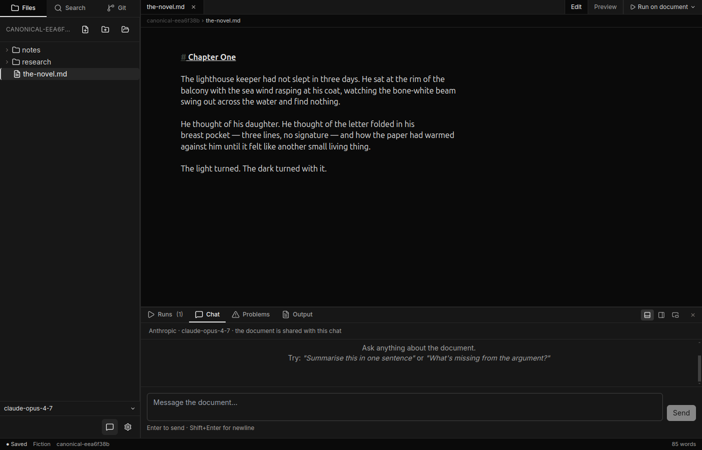

# Chat and tools

The **Chat panel** lets you have a back-and-forth conversation with an AI assistant that can read, search, and — with your approval — write files in your workspace.

Use chat when a task spans more than one file, needs several steps, or requires the assistant to look something up before it acts. For quick one-shot improvements to a selection — tighten a paragraph, check grammar, rewrite a section — the [agent toolbar](the-editor.md) in the editor is faster.

---

## Chat vs. the editor agents

| | Editor agent | Chat |
|---|---|---|
| **Good for** | Improving a selection in the open file | Multi-step or cross-file tasks |
| **How you start** | Select text → floating toolbar | Chat panel → type a message |
| **Sees your workspace** | Only the selected text (plus any pinned files) | The full workspace tree and open document |
| **Writes files** | Proposes a replacement you can Apply or Discard | Asks your approval before each file change |
| **Conversation memory** | Single turn | Ongoing across messages until you clear the history |

---

## Opening the chat panel

Click the **chat bubble icon** in the bottom-left corner of the sidebar. The bottom panel opens with the Chat tab active. The header shows the current provider and model — you can change both in Settings.

To close the panel, click the icon again or press the **X** in the panel header.

---

## The 9 tools

During a chat turn the assistant can call any of these tools. Read-only tools run automatically; mutating tools pause and ask for your approval first.

| Tool | What it does | Reads or writes | Requires approval |
|------|--------------|-----------------|-------------------|
| `list_dir` | Lists the immediate contents of a workspace folder | Read | No |
| `read_file` | Reads the full text of a workspace file (up to 1 MB) | Read | No |
| `search_workspace` | Searches files for a substring or regex, returning up to 1,000 matches | Read | No |
| `create_file` | Creates a new file with optional initial content | Write | Yes |
| `edit_file` | Replaces the entire contents of an existing file | Write | Yes |
| `delete_file` | Permanently removes a file from your workspace | Write | Yes |
| `rename_file` | Moves or renames a file to a new path | Write | Yes |
| `create_folder` | Creates a new folder (intermediate folders are created as needed) | Write | Yes |
| `set_todos` | Records a step-by-step plan as a checklist — no disk changes | Neither | No |

**Tip:** You can watch each read-only call as it happens. A small chip appears in the assistant's message bubble showing the tool name, file path, and a summary (e.g. "3 entries", "47 lines", "2 matches"). Click the chip to expand the raw output.

<!-- Screenshot placeholder: tool chip showing a list_dir result -->
<!-- docs/screenshots/chat-and-tools/tool-chip.png — deferred (see MANUAL.md) -->

---

## Approval cards

Before any mutating tool runs, the chat pauses and shows an **approval card** in the assistant's message bubble.

<!-- Screenshot placeholder: approval card in pending state -->
<!-- docs/screenshots/chat-and-tools/approval-card-pending.png — deferred (see MANUAL.md) -->

The card shows what the assistant wants to do — for example:

- **Create `chapters/chapter-03.md`** — with a preview of the new content
- **Edit `outline.md`** — with a colour-coded diff of what changes
- **Delete `drafts/old-opening.md`**
- **Rename `notes.md` → `research/notes.md`**

You have three buttons:

| Button | Effect |
|--------|--------|
| **Approve** | Run this one tool call. Future calls in the same turn still need individual approval. |
| **Deny** | Skip this tool call. The assistant is told the action was denied and continues its turn. |
| **Approve rest of turn** | Run this call and automatically approve every subsequent mutating tool in the same turn. The next message you send starts fresh — all approvals are required again. |

<!-- Screenshot placeholder: approval card after Approve was clicked -->
<!-- docs/screenshots/chat-and-tools/approval-card-approved.png — deferred (see MANUAL.md) -->

After you decide, the card updates to show `✓ approved`, `✗ denied`, or `— cancelled` (if you stopped the turn mid-way).

---

## The plan card (set_todos)

For multi-step tasks the assistant often starts by calling `set_todos` to lay out its plan as a checklist before doing any work. You'll see a **Plan** card in the message bubble listing each step, with a status indicator:

- An animated dot next to the step it is currently working on
- A strikethrough checkmark for completed steps
- An empty checkbox for upcoming steps

The plan card is purely informational — it has no effect on your files. It helps you track where the assistant is in a long task and spot if it is about to do something you did not expect.

<!-- Screenshot placeholder: plan card with mixed pending/in-progress/completed items -->
<!-- docs/screenshots/chat-and-tools/todo-card.png — deferred (see MANUAL.md) -->

---

## Tool budget

Each message you send starts a **turn**. Within one turn the assistant can call tools in multiple rounds: it reads a file, considers what to do, calls another tool, and so on. The **tool budget** caps how many rounds can happen before the assistant is asked to write a final answer and stop calling tools.

The default is **10 rounds per message** (set in `useSettings.ts` as `chatToolBudget: 10`).

When the budget is reached, the assistant writes a final prose answer with whatever it has managed to accomplish. If the task was interrupted mid-way, it will explain what is left to do — you can then send a follow-up message to continue.

<!-- Screenshot placeholder: synthetic note shown when the tool budget is exhausted -->
<!-- docs/screenshots/chat-and-tools/tool-budget-reached.png — deferred (see MANUAL.md) -->

To change the budget, open **Settings** (gear icon in the sidebar footer or `Ctrl+,`) and find the **Chat tool budget per message** field. Lower it if you want shorter, more focused turns; raise it for complex multi-file rewrites.

---

## Chat history

Your conversation is saved automatically in your browser's local storage under the key `canv:chat`. It persists across restarts until you clear it.

To clear the conversation, click **Clear** in the chat panel header and confirm the dialog. Clearing is permanent — there is no undo. The chat is also automatically cleared if you switch provider (Anthropic ↔ OpenAI) mid-conversation.

<!-- Screenshot placeholder: chat panel with a message exchange -->
<!-- docs/screenshots/chat-and-tools/chat-with-message.png — deferred (see MANUAL.md) -->

---

## Privacy

The chat assistant sees everything your workspace contains: file names, folder structure, and the content of any file it reads with `read_file` or `search_workspace`. The open document is always included in the system context.

Nothing leaves your machine except for the messages sent to the LLM API (Anthropic or OpenAI) as part of each turn. Your files are never uploaded elsewhere.

If your workspace contains sensitive material you would not want to share with the LLM, do not open it in Canv, or move those files outside the workspace folder before using chat.
