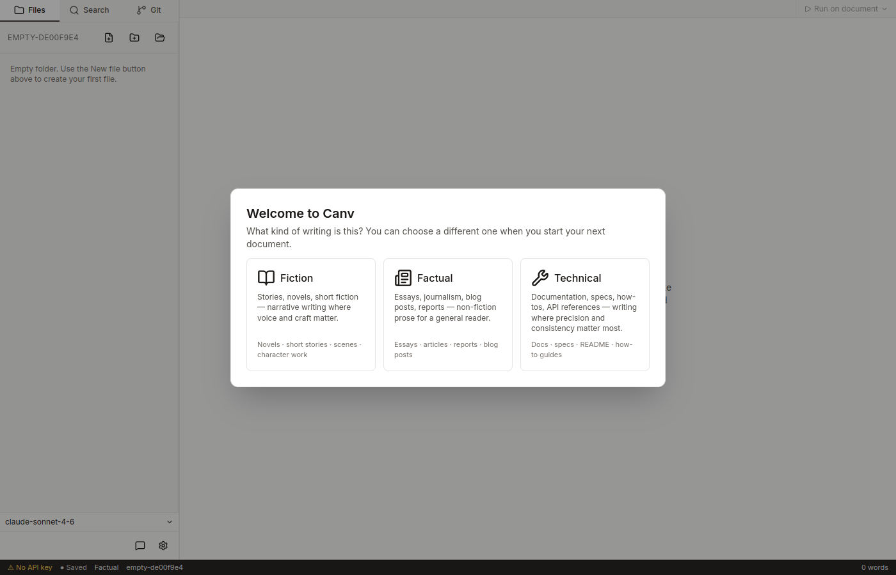
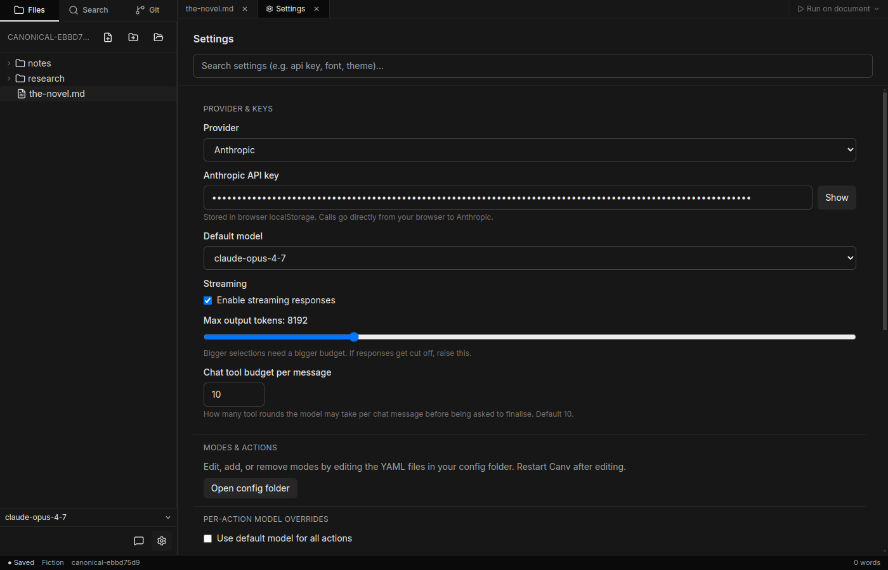
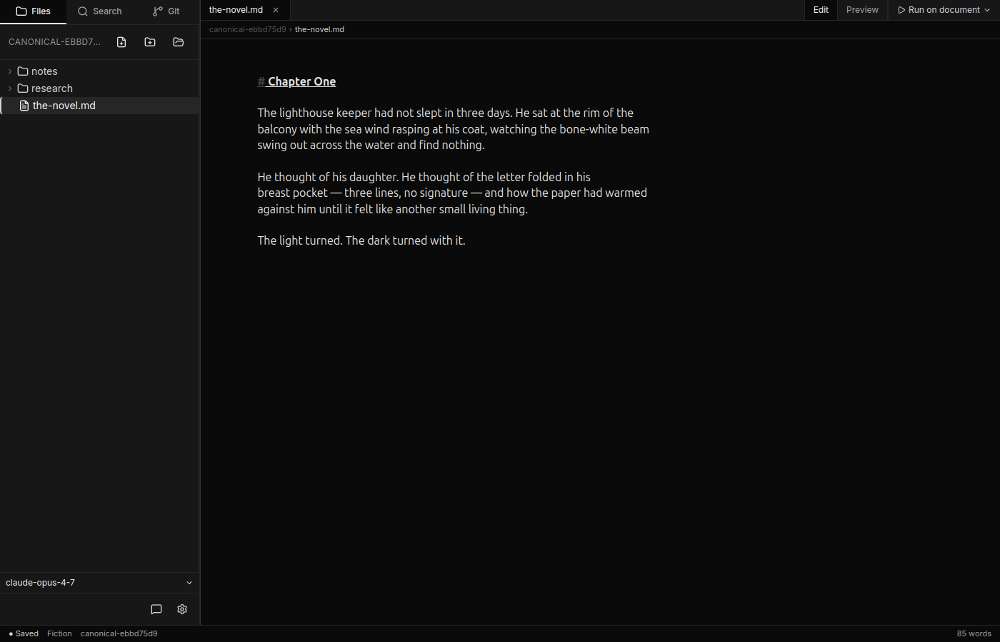
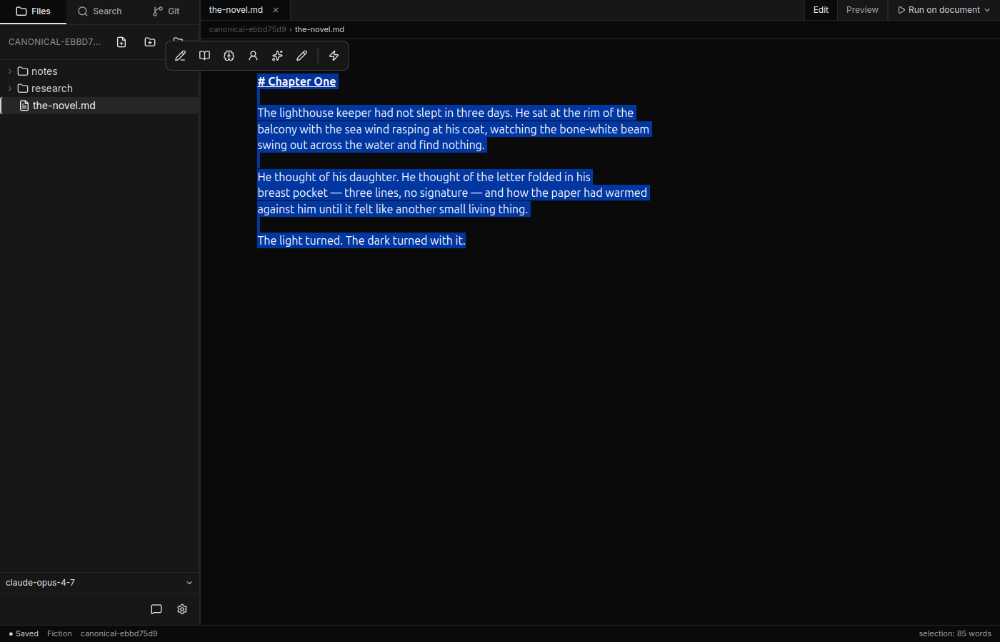
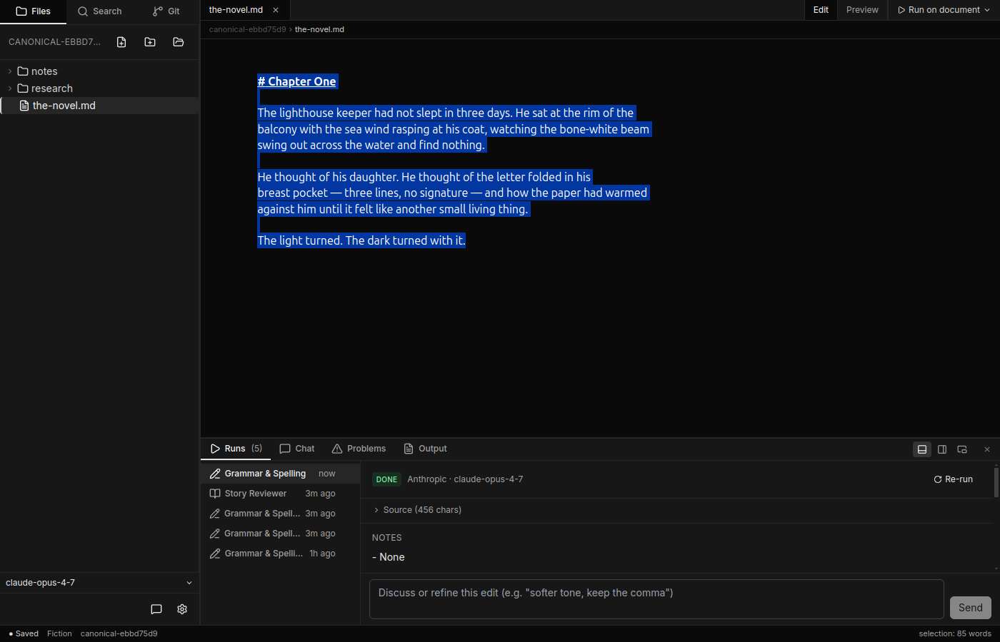

# Getting started

This page walks you from a fresh install to running your first agent — about
five minutes once you have an API key.

## 1. Install Canv

See [Install](../README.md#install). Open the app once it's installed.

## 2. Pick a profile

On first launch a **Welcome to Canv** dialog appears asking what kind of
writing you're doing. Three profiles are bundled:

- **Fiction** — Grammar & Spelling, Story Reviewer, Logic Checker, Test
  Reader, Refine, Free Edit, plus presets like Polish, Make Shorter, Make
  Longer, Simplify, More Sophisticated, and Brainstorm.
- **Factual** — agents tuned for essays, journalism, blog posts, and reports.
- **Technical** — agents tuned for documentation, specs, READMEs, and
  how-to guides.

You can switch profiles later. For this walkthrough, choose **Fiction**.

## 3. Open or create a workspace

A **workspace** is a folder of markdown files on your computer. Pick an
empty folder to start fresh, or open one with existing `.md` files. Canv
never copies your files anywhere — they stay where you put them.

## 4. Add an API key

Click the gear icon at the bottom of the left sidebar to open **Settings**.
Go to the **Provider & Keys** section. Select your provider (Anthropic or
OpenAI) from the dropdown, then paste your API key into the matching field.
Keys are stored on your computer only; Canv has no backend.

You don't need both keys. Add the one you have; Canv will use it.

## 5. Write something

Click a file in the sidebar to open it. The editor is markdown — `**bold**`,
`# headings`, lists, links, all of it works. You can also create a new file
with the new-file button at the top of the sidebar.

## 6. Run your first agent

Select some text. A floating toolbar appears above the selection with the
agents for the current profile. Click **Grammar & Spelling** (or any other
agent) to run it.

The result streams into the panel at the bottom. When it finishes, you see
a **before/after diff** and an **Apply** button.

Click **Apply** to replace your selection with the agent's rewrite.

## What next

- [The editor](the-editor.md) — formatting, themes, the document menu.
- [Profiles and agents](profiles-and-agents.md) — what each agent does and
  how to customise them.
- [Chat and tools](chat-and-tools.md) — for tasks bigger than a single
  selection.
