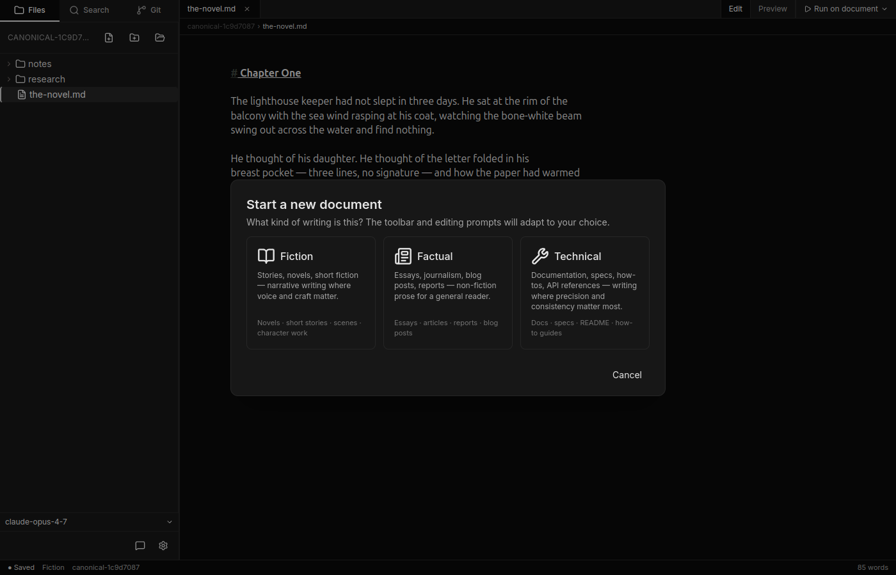
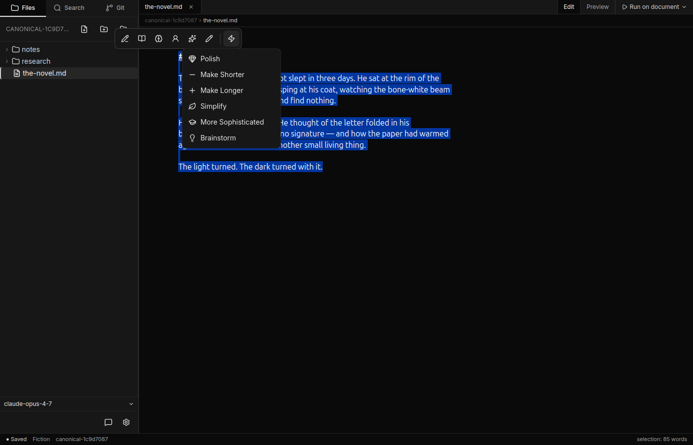
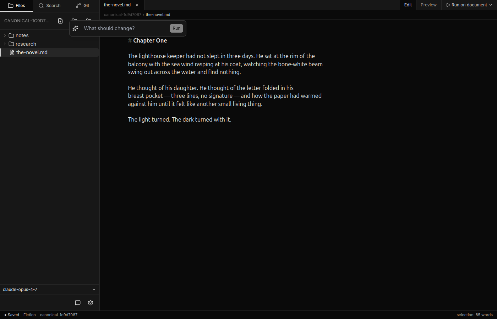
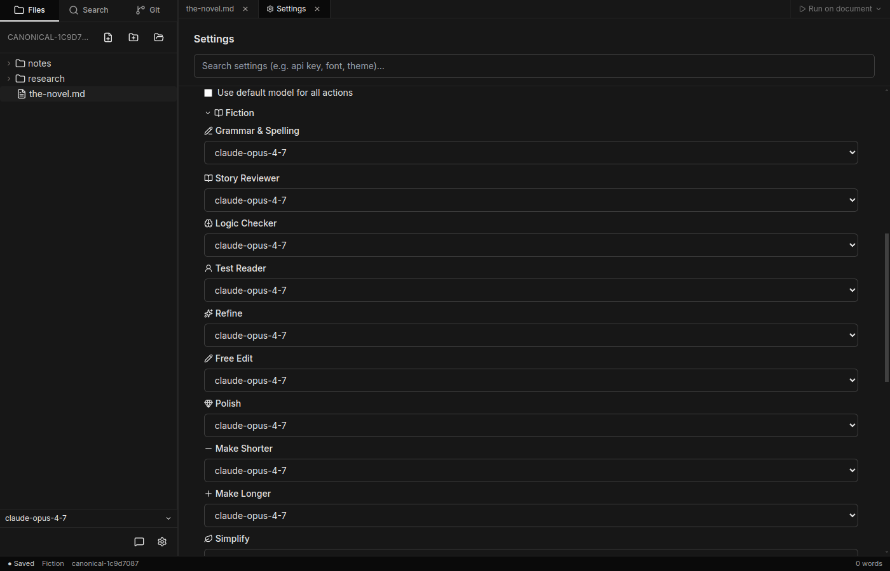

# Profiles and agents

A **profile** is a writing context: a curated set of agents tuned for a kind of work. Canv ships with three profiles, and you can switch at any time. Switching is non-destructive — your text stays put; the agent set changes.

To switch profile mid-session, click the profile name in the status bar at the bottom of the editor window.

## Where agents appear

Selection agents appear in the **floating toolbar** when you select text in the editor. Whole-document agents appear in the **document agent menu** in the editor toolbar. The same agent can appear in either place if it supports both modes.

Core agents show as icon buttons in the floating toolbar. Preset agents are grouped behind the lightning-bolt (⚡) button — click it to expand them.

## The Fiction profile

*Stories, novels, short fiction — narrative writing where voice and craft matter.*

| Agent | Group | Scope | What it does |
|-------|-------|-------|--------------|
| **Grammar & Spelling** | core | selection or document | Reviews the text for grammar, spelling, punctuation, and clarity errors — light-handed with style. Preserves voice, dialogue conventions, intentional fragments, and rhythm. |
| **Story Reviewer** | core | selection or document | Produces rich, specific editorial feedback: opening hook, pacing, scene structure, character motivation, tension and stakes, dialogue, prose rhythm, emotional arc, and payoff vs setup. |
| **Logic Checker** | core | selection or document | Checks narrative consistency: continuity errors, character behaviour contradicting prior characterisation, plot holes, unclear references, broken cause-and-effect, and timeline inconsistencies. |
| **Test Reader** | core | selection or document | Reacts as a first-time reader — in first person — covering what gripped you, what confused you, pacing, surprises, voice and tone, and how the ending landed. |
| **Refine** | core | selection | Asks for a custom instruction, then rewrites the selection according to it. |
| **Free Edit** | core | selection | Asks for a note, applies the change, and explains the reasoning so you can decide whether to accept the edit. |
| **Polish** *(preset)* | presets | selection | Tightens rhythm, varies sentence length, sharpens sensory detail, cuts weak intensifiers, prefers concrete over abstract. Preserves voice and meaning. |
| **Make Shorter** *(preset)* | presets | selection | Rewrites to be roughly 30% shorter without losing meaning. Preserves voice. |
| **Make Longer** *(preset)* | presets | selection | Rewrites to be about 50% longer with richer detail and texture. Preserves voice and meaning. |
| **Simplify** *(preset)* | presets | selection | Rewrites for a general audience at roughly an 8th-grade reading level — shorter sentences, simpler vocabulary. |
| **More Sophisticated** *(preset)* | presets | selection | Rewrites at a more sophisticated reading level — richer vocabulary, more varied sentence structure, more precise word choice. |
| **Brainstorm** *(preset)* | presets | selection | Asks for an instruction (e.g. "10 alt names"), then generates a numbered list of ideas using the selected text as context. |

## The Factual profile

*Essays, journalism, blog posts, reports — non-fiction prose for a general reader.*

This is the default profile for new documents.

| Agent | Group | Scope | What it does |
|-------|-------|-------|--------------|
| **Grammar & Spelling** | core | selection or document | Reviews for grammar, spelling, punctuation, and clarity errors. |
| **Logic Checker** | core | selection or document | Reviews for contradictions, gaps in reasoning, unclear references, factual inconsistencies, and unsupported claims. |
| **Test Reader** | core | selection or document | Reacts as a first-time reader in first person — what gripped you, what confused you, pacing, surprises, voice and tone, and how the ending landed. |
| **Refine** | core | selection | Asks for a custom instruction, then rewrites the selection according to it. |
| **Free Edit** | core | selection | Asks for a note, applies the change, and explains the reasoning so you can decide whether to accept the edit. |
| **Summarise** | core | selection or document | Condenses the text to its key points. |
| **Polish** *(preset)* | presets | selection | Fixes small awkwardness, tightens phrasing, improves flow and rhythm. Preserves meaning and voice. |
| **Make Shorter** *(preset)* | presets | selection | Rewrites to be roughly 30% shorter without losing meaning. Preserves voice. |
| **Make Longer** *(preset)* | presets | selection | Rewrites to be about 50% longer with richer detail and texture. Preserves voice and meaning. |
| **Simplify** *(preset)* | presets | selection | Rewrites for a general audience — shorter sentences, simpler vocabulary. |
| **More Sophisticated** *(preset)* | presets | selection | Rewrites at a more sophisticated reading level — richer vocabulary, more varied sentence structure, more precise word choice. |
| **Add Emojis** *(preset)* | presets | selection | Adds tasteful emojis where they fit naturally — one or two per paragraph at most. |
| **Translate** *(preset)* | presets | selection | Asks for a target language, then translates the selection. Preserves tone and meaning. |
| **Brainstorm** *(preset)* | presets | selection | Asks for an instruction, then generates a numbered list of ideas using the selected text as context. |

## The Technical profile

*Documentation, specs, how-tos, API references — writing where precision and consistency matter most.*

| Agent | Group | Scope | What it does |
|-------|-------|-------|--------------|
| **Grammar & Spelling** | core | selection or document | Reviews for grammar, spelling, punctuation, and clarity errors; also flags inconsistent terminology, passive voice, ambiguous pronoun references, and unnecessary hedging. |
| **Logic Checker** | core | selection or document | Reviews for contradictions, gaps in reasoning, claims unsupported by stated evidence, undefined terminology, ambiguous references, and steps that assume knowledge not yet introduced. |
| **Test Reader** | core | selection or document | Reacts as a first-time reader trying to use the document as a reference — what was clear, what was ambiguous, where you got stuck, what assumed knowledge tripped you up, what examples you wanted. |
| **Refine** | core | selection | Asks for a custom instruction, then rewrites the selection according to it. |
| **Free Edit** | core | selection | Asks for a note, applies the change, and explains the reasoning so you can decide whether to accept the edit. |
| **Summarise** | core | selection or document | Condenses the text to its key points. |
| **Polish** *(preset)* | presets | selection | Tightens phrasing, removes filler, prefers active voice, ensures terminology is consistent, cuts hedging where the author can be definite. |
| **Make Shorter** *(preset)* | presets | selection | Rewrites to be roughly 30% shorter without losing meaning. Preserves voice. |
| **Simplify** *(preset)* | presets | selection | Rewrites so a reader unfamiliar with the topic can follow it — defines terminology on first use, replaces jargon with plain language. Preserves technical accuracy. |
| **More Sophisticated** *(preset)* | presets | selection | Rewrites at a more sophisticated reading level — richer vocabulary, more varied sentence structure, more precise word choice. |

## Custom instructions

Some agents — **Refine**, **Free Edit**, **Brainstorm**, and **Translate** — ask for a one-line instruction before they run. When you click one of these agents, the toolbar expands into an input field. Type your instruction and press Enter (or click Run).

The instruction placeholder text gives you a hint about what to type: for Refine it's "What should change?"; for Brainstorm it's "What to brainstorm? (e.g. 10 alt names)"; for Translate it's "Target language (e.g. French)".

## Per-agent model overrides

By default, every agent uses your provider's default model. You can override the model for any single agent — useful for using a more capable model on agents that need it (Story Reviewer, Brainstorm) while keeping a cheaper model for routine ones (Grammar & Spelling).

To configure overrides:

1. Open **Settings** (gear icon in the sidebar footer, or click the API-key warning in the status bar).
2. Scroll to **Per-action model overrides**.
3. Uncheck **Use default model for all actions**.
4. Expand the profile you want to configure and set a model for each agent.

## Editing system prompts

Each agent has a system prompt that defines its role and rules. These prompts live in the YAML files inside the config folder. To open it, go to **Settings → Modes & actions → Open config folder**. You can edit any `.yaml` file there and restart Canv to apply the changes. An in-app prompt editor is planned for a future release.

## Selection vs whole-document

Agents with **selection or document** scope work in both contexts. When you select text, the floating toolbar offers them. When you use the document agent menu (no selection active), they run over the whole document. The agent's behaviour adapts to its input — Grammar & Spelling on a sentence is a sentence-level review; Grammar & Spelling over the full document is a document-wide pass.

Agents with **selection** scope (Refine, Free Edit, and all presets) appear only in the floating toolbar and act only on selected text.

## What next

- [Results and applying](results-and-applying.md) — what happens after you click an agent.
- [Chat and tools](chat-and-tools.md) — the chat panel handles multi-step tasks that no single agent can do.
