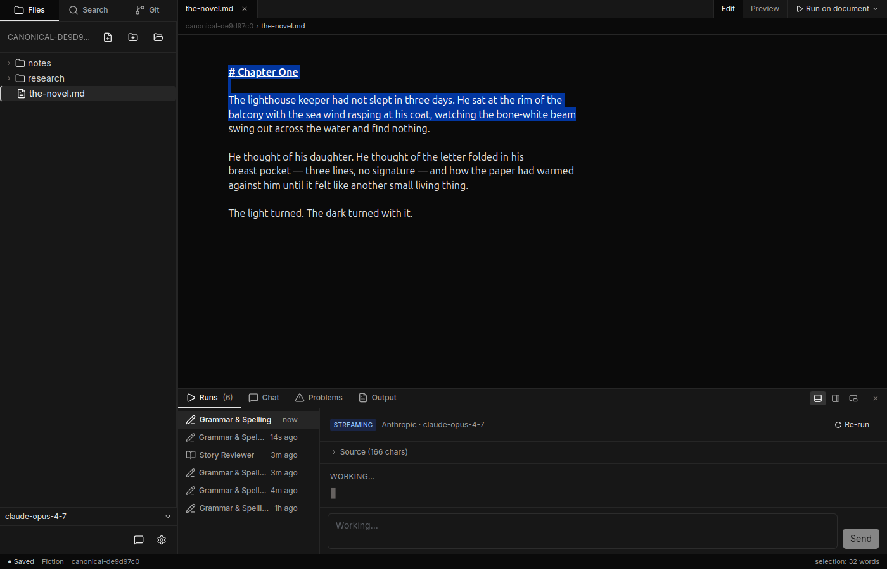
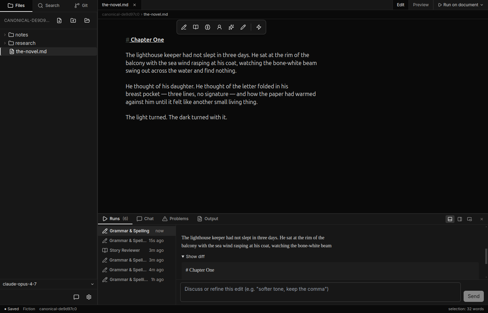
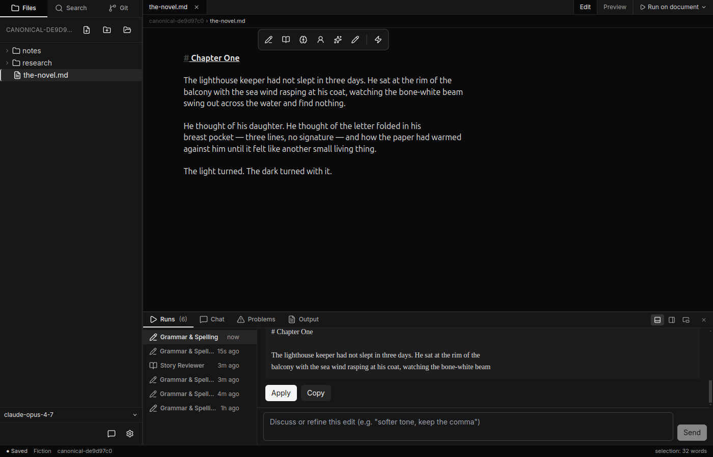
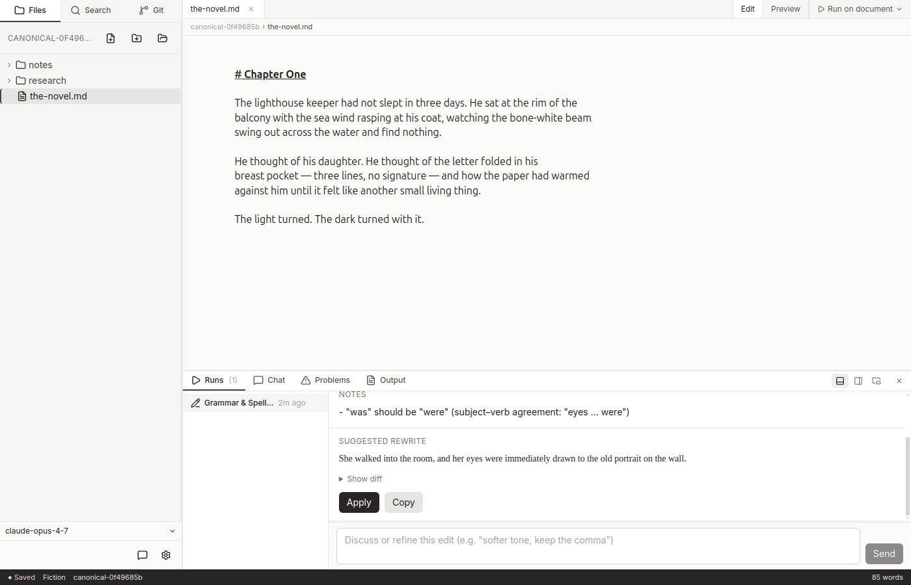
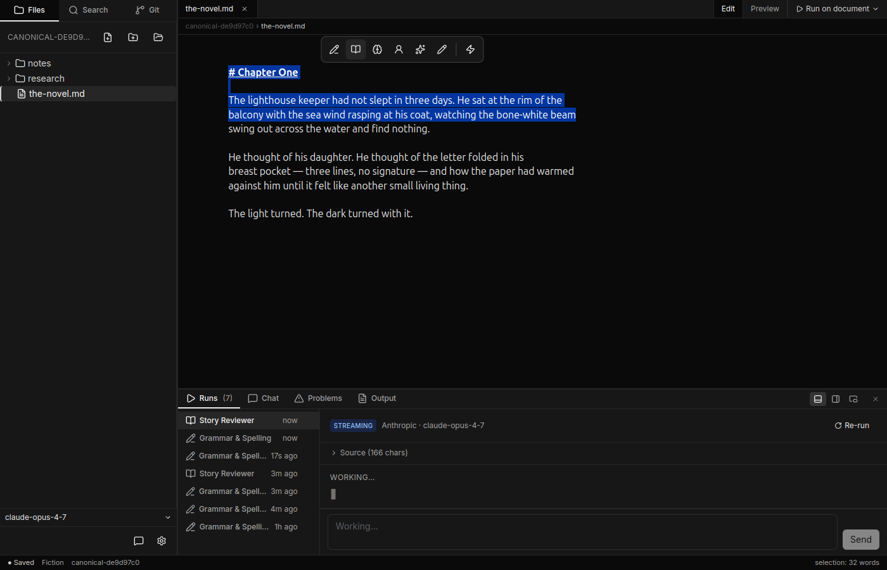

# Results and applying

When an agent finishes working, its output appears in the **results panel**
on the right side of the editor. (For the overall layout see
[The editor](the-editor.md).)

## Streaming

As soon as you trigger an agent the results panel opens and tokens appear in
real time — you can start reading the rewrite while the model is still
composing it. A blue **Streaming** badge in the panel header shows that the
run is in progress.

## The before/after diff

Once streaming finishes, a **Show diff** link appears below the rewrite.
Click it to expand an inline diff between your original selection and the
agent's suggestion:

- **Green highlight** — text the agent added.
- **Red strikethrough** — text the agent removed.
- Unchanged text appears unstyled.

Click **Show diff** again to collapse it.

## Applying the result

Click **Apply** to replace your original selection (or the entire document,
if you ran an agent on the whole file) with the rewrite.

### Stale-selection guard

If the run was created with an older internal format, the **Apply** button is
disabled and shows a tooltip:

> *Run was created with the previous editor — re-run to apply*

This protects you from accidentally overwriting text with a result that may
no longer correspond to what is in the editor. Click **Re-run** (the
circular-arrow button in the panel header) to run the same agent again and
get a fresh result you can apply.

## Copying the result

**Copy** (next to Apply) puts the rewrite on the clipboard without touching
the document — useful when you want to paste it somewhere else or compare
alternatives manually.

## Re-running

**Re-run** (⟳ Re-run in the panel header) repeats the same agent on the
same original selection. Use it to get a fresh take or to recover after
the stale-selection guard fires.

## Run history

The strip of tabs along the top of the panel keeps up to **10** recent runs.
Click any tab to switch between them. Each tab shows the agent's icon, its
short name, and how long ago the run completed. Close a tab with the × that
appears on hover.

## The chat tab

The same panel also contains a **Chat** tab for an open-ended conversation
with the model. See [Chat and tools](chat-and-tools.md) for details.
