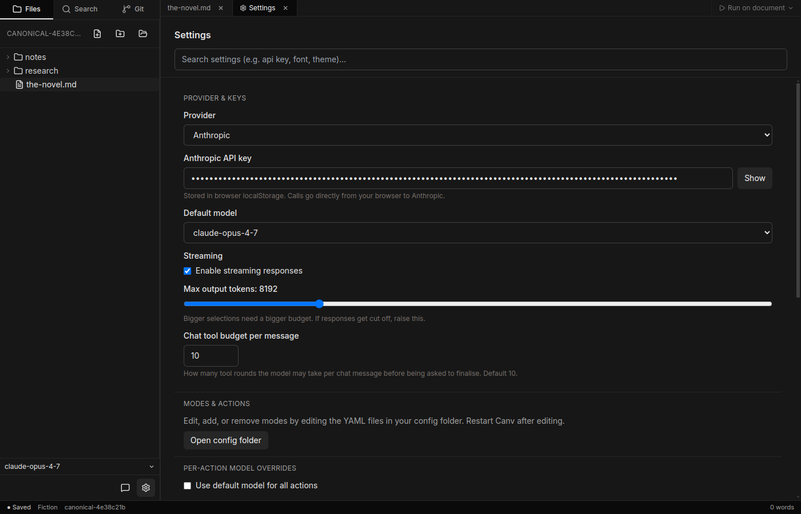
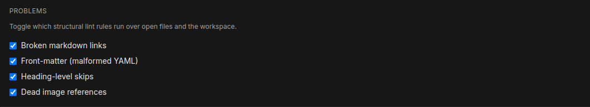
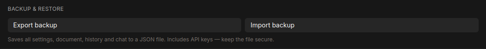
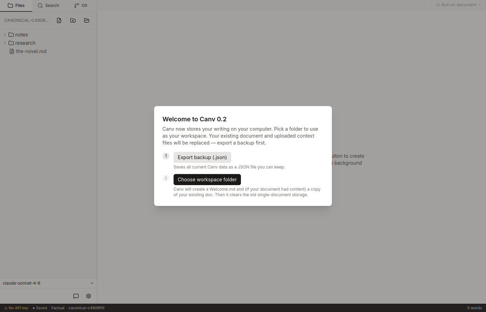

# Settings and data

## The settings tab

The settings tab is the main place to configure Canv. Open it by clicking the **gear icon** in the bottom-left corner of the sidebar, or by searching from any settings field.

The tab has a search bar at the top. Type any keyword (e.g. `api`, `font`, `theme`, `lint`) to filter the sections shown.

---

## API keys and provider

In the **Provider & Keys** section you choose which AI provider to use (Anthropic or OpenAI) and enter your API key for that provider.

- Paste your key into the field. Use the **Show / Hide** toggle to check what you typed.
- The placeholder hint shows the expected prefix: `sk-ant-…` for Anthropic, `sk-…` for OpenAI.
- Your key is stored **on your computer only**, inside Canv's local storage. It is never sent to Canv's servers. API requests go directly from your machine to the provider. See [Privacy](#privacy) below.

---

## Default model and per-action overrides

The **Default model** dropdown in the Provider & Keys section sets which model Canv uses for all actions unless you override it. The **Per-action model overrides** section lets you assign a different model to specific actions within each mode.

Full details are in [Profiles and agents](profiles-and-agents.md).

---

## Editor and typography

The **Editor** section controls font size, line width (narrow / normal / wide), and colour theme (system / light / dark).

Full details are in [The editor](the-editor.md).

---

## Lint rules

The **Problems** section controls which structural checks Canv runs over your open files and workspace. Each rule can be toggled on or off independently.

| Rule | What it checks |
|------|---------------|
| **Broken markdown links** | `[text](path)` links where the target file does not exist in the workspace |
| **Front-matter (malformed YAML)** | YAML front matter blocks that cannot be parsed |
| **Heading-level skips** | Headings that jump more than one level (e.g. `# H1` immediately followed by `### H3`) |
| **Dead image references** | `` references where the image file does not exist |

Results appear in the **Problems** panel at the bottom of the window and as underline markers in the editor. All four rules are on by default. Turning off a rule removes its markers immediately — it does not affect your files.

---

## Chat tool budget

The **Chat tool budget per message** field in the Provider & Keys section sets the maximum number of tool rounds the model may take per chat message before being asked to produce a final answer. The default is 10.

Full details are in [Chat and tools](chat-and-tools.md).

---

## Streaming and max output tokens

Two additional controls in the **Provider & Keys** section affect how responses are delivered:

- **Streaming** — when enabled (the default), responses appear word-by-word as the model generates them. Disable this if your network connection or a corporate proxy has trouble with server-sent events.
- **Max output tokens** — a slider from 1 024 to 32 768 tokens. The default is 8 192. If agent responses are cut off mid-sentence, raise this value. Larger selections generally need a larger budget.

---

## Backup and export

The **Backup & Restore** section has two buttons: **Export backup** and **Import backup**.

### What the export contains

Clicking **Export backup** downloads a JSON file named `canv-backup-YYYY-MM-DD.json`. It contains every key Canv stores in its local data store — that is: your settings (including API keys), run history, chat history, recent workspaces, and any other Canv state. **It does not contain your document files.** Your `.md` files live in your workspace folder on disk and are not touched by this process.

The backup file includes your API keys. Keep it in a secure location.

### When to use it

- Before switching computers: export on the old machine, import on the new one.
- Before a destructive change such as deleting the user-data folder.
- As a periodic snapshot of your configuration and run history.

### Importing

Click **Import backup** and choose a `.json` file previously exported from Canv. A confirmation dialog warns you that importing overwrites all current settings, history, and API keys. After a successful import Canv reloads automatically.

---

## Migration from older versions

If you have data from a version of Canv that stored your document in the app itself (rather than in a workspace folder), you will see the **Welcome to Canv 0.2** migration modal the first time you launch.

### What triggers it

The modal appears when Canv detects previous-version data in its storage — specifically, when any of the keys `canv:document`, `canv:title`, or `canv:contextFiles` are present and the storage schema has not already been upgraded to version 2.

### What it does

The modal walks you through two steps:

1. **Export backup (.json)** — downloads a full backup of your current data before anything is changed.
2. **Choose workspace folder** — opens a folder picker. Once you choose a folder, Canv:
   - Creates a `Welcome.md` file in the folder (explaining the new workspace model).
   - Converts your legacy document from its old format to Markdown and writes it as a `.md` file in that folder (if there was any content).
   - Clears the old single-document storage keys.
   - Sets the workspace to the folder you chose.

### If you do not need it

If the modal appears but you have no data worth keeping, you can still proceed: export the backup first (step 1) just to satisfy the two-step flow, then choose any folder as your workspace.

---

## Where data lives on disk

| OS | User data folder |
|----|-----------------|
| macOS | `~/Library/Application Support/Canv/` |
| Linux | `~/.config/Canv/` |
| Windows | `%APPDATA%\Canv\` |

This folder holds Canv's settings, run history, and chat history. It does **not** hold your documents — those live wherever your workspace folder is, and Canv never moves them.

The config sub-folder (`<user-data>/config/`) holds your mode and action YAML files. The **Open config folder** button in the **Modes & actions** section of Settings opens it in your system file manager.

---

## Privacy

Your API key is stored in Canv's local data on your computer and nowhere else. API calls go directly from your machine to the provider (Anthropic or OpenAI) — they do not pass through any Canv server. Canv does not collect analytics or telemetry.

---

## Resetting Canv to factory defaults

To start completely fresh:

1. Quit Canv.
2. Delete the user data folder for your OS (see the table above).
3. Relaunch Canv.

This clears all settings, run history, and API keys. Your workspace documents are unaffected because they live in a separate folder that you chose.
