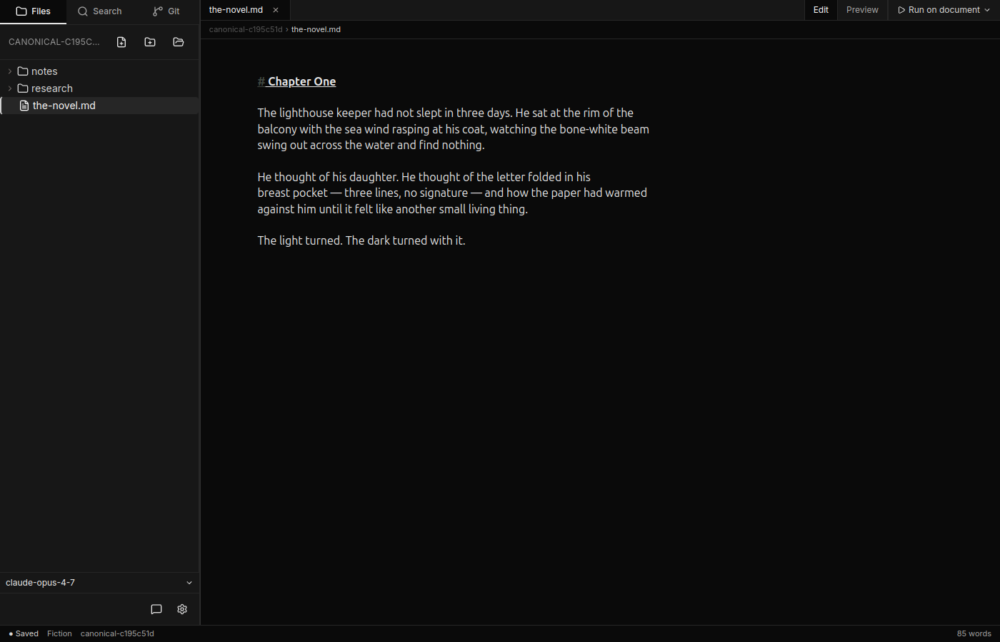
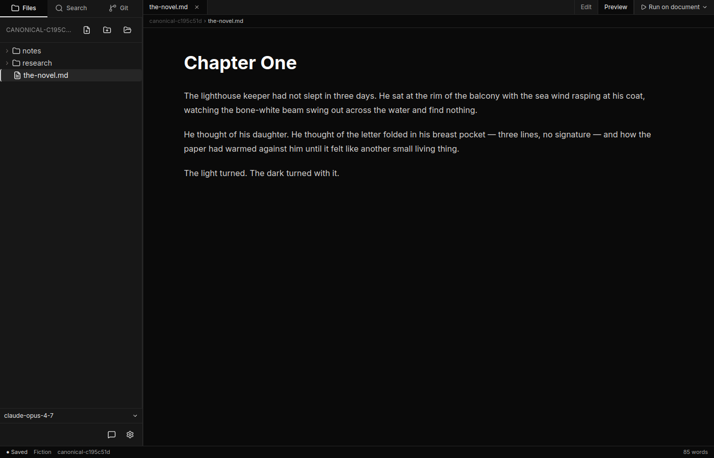
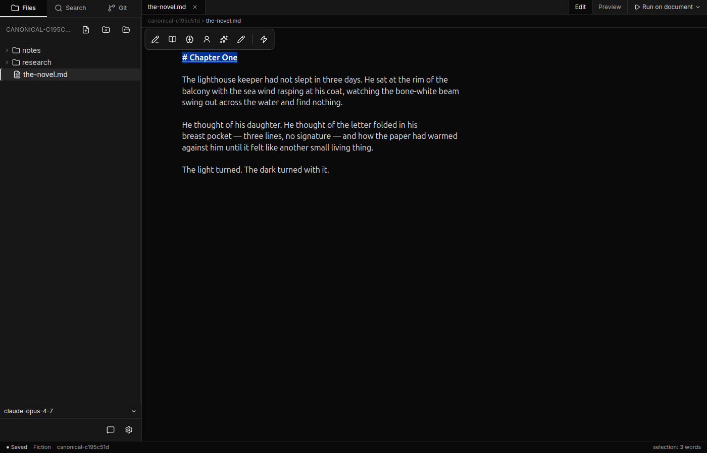
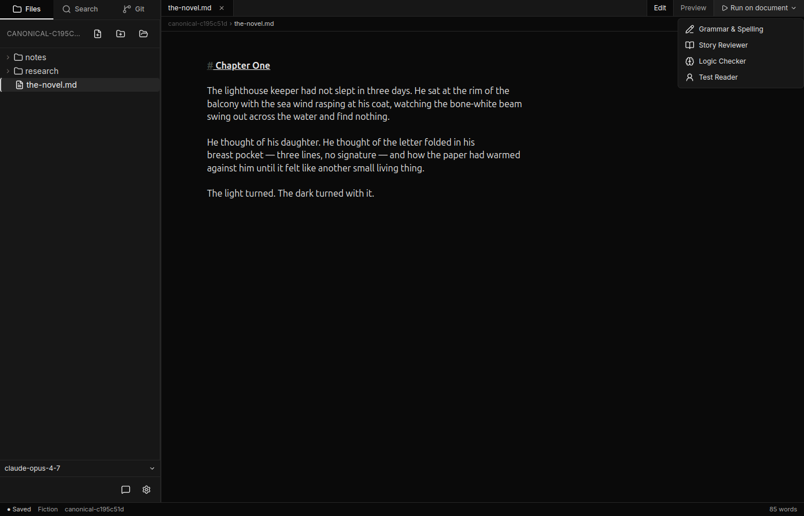
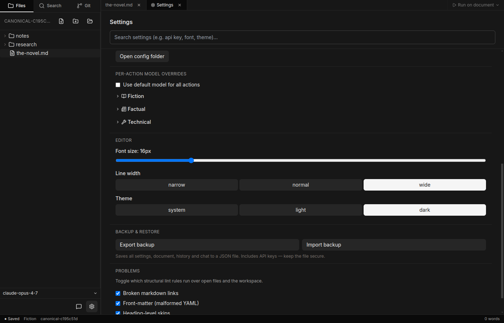
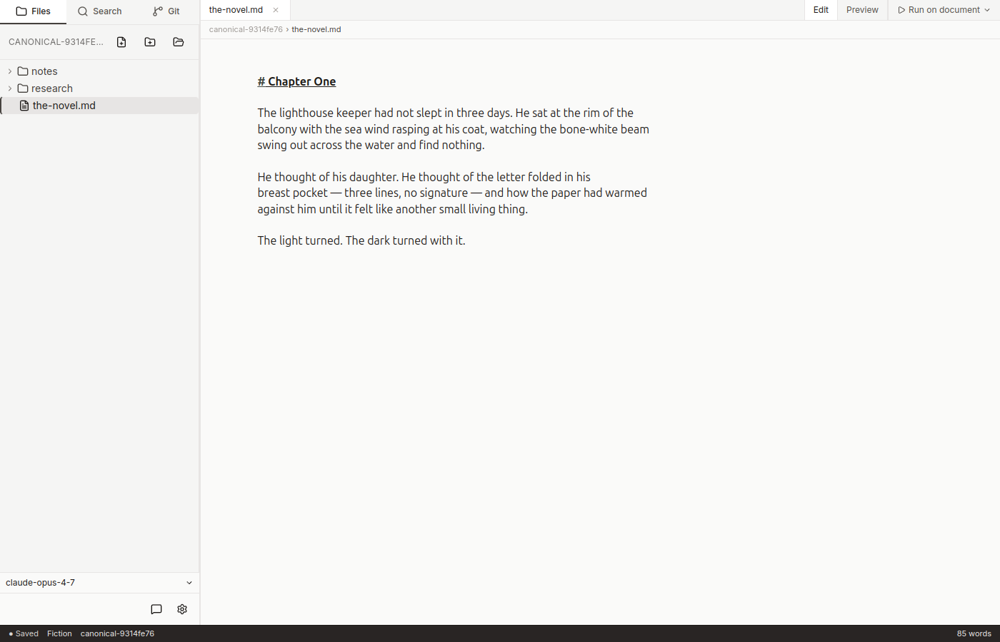

# The editor

Canv's canvas is a full **markdown** editor. You write in markdown and it
stays markdown — Canv never converts your file behind your back.



## Markdown formatting

Everything in [CommonMark](https://commonmark.org/) plus tables and task
lists works:

- `# Heading 1`, `## Heading 2`, … through six.
- `**bold**`, `*italic*`, `` `inline code` ``.
- `- item` for unordered lists, `1. item` for ordered.
- `> quote` for block quotes.
- ` ```language ` for fenced code blocks (syntax highlighting included).
- `[label](url)` for links, `` for images.
- Pipe tables: `| col | col |` followed by `| --- | --- |`.

The editor is built on [CodeMirror 6](https://codemirror.net/), so you also
get find-and-replace (**⌘F** / **Ctrl+F**), undo/redo, multi-cursor
selection, and the usual keyboard navigation.

## Preview

Toggle preview to see the rendered output. Your raw markdown is unchanged
— preview is just a render.



## The floating toolbar

Select any text. A floating toolbar pops up just above the selection with
the agents from your current profile.



Click an agent and the run begins. Some agents (like **Refine**) ask for a
custom instruction first — type one and press Enter. Results stream into
the panel on the right; see [Results and applying](results-and-applying.md).

## The document agent menu

For agents that act on the **whole document** (rather than a selection),
use the document agent menu. It lives in the editor toolbar and offers the
same agents that support whole-document mode in your current profile.



Selection agents and document agents share the same panel for results.

## Right-click context menu

Right-click in the editor for **Copy** and **Select all**. The same menu
exists on the file tree and in the chat panel — see those pages for what
each one offers.

## Typography and theme

In Settings you can change:

- **Font size** — the editor and preview both follow.
- **Line width** — controls the maximum text column.
- **Theme** — light or dark.



Light theme:



## What next

- [Profiles and agents](profiles-and-agents.md) — what each agent on the
  toolbar actually does.
- [Results and applying](results-and-applying.md) — what happens after you
  click an agent.
