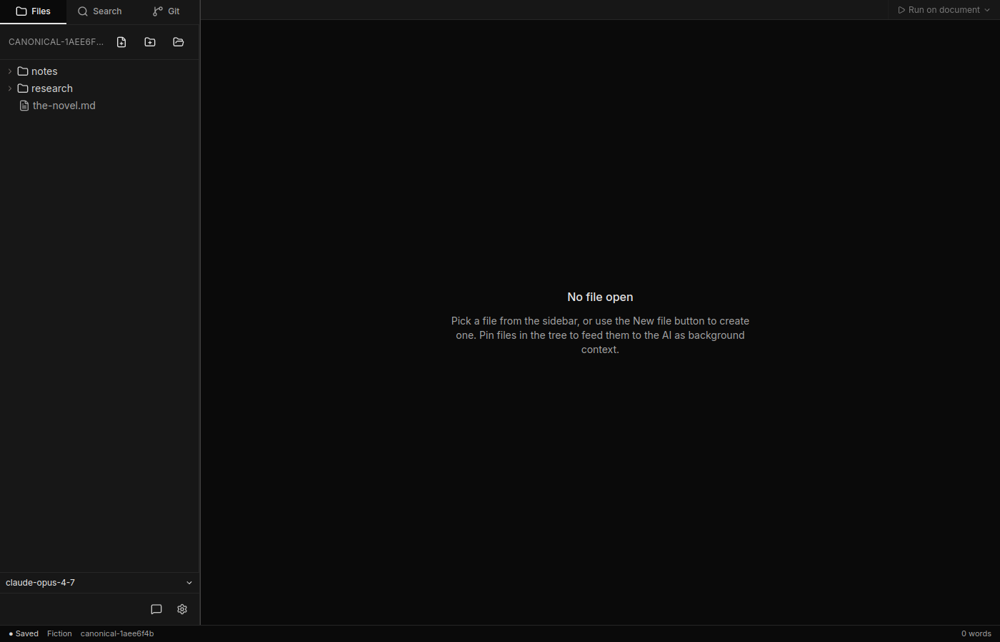
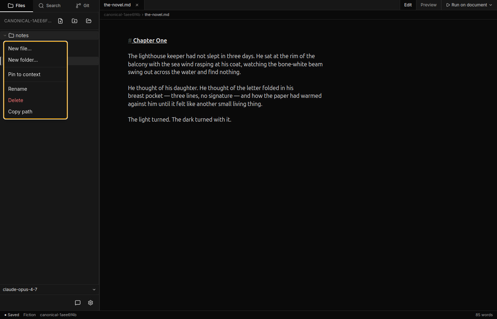
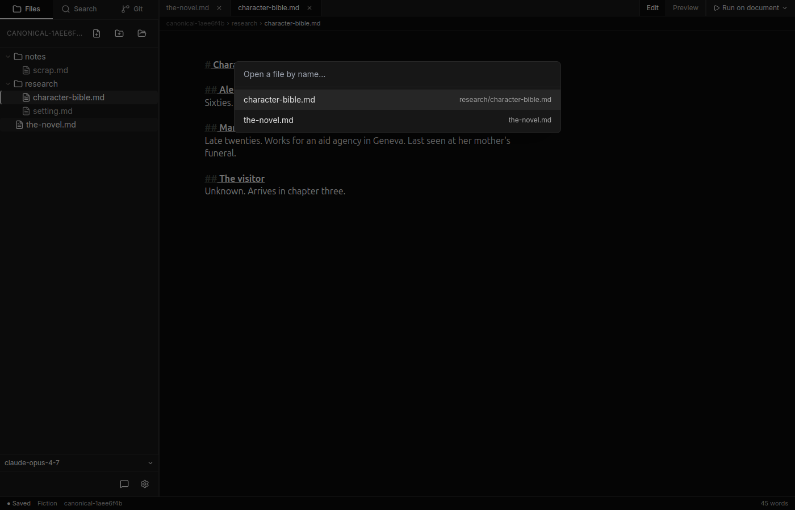
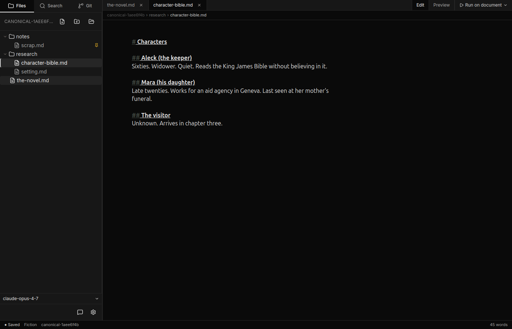

# Workspaces and files

## What is a workspace?

A workspace is a folder on your computer. You choose it — Canv opens it, watches it for changes, and shows its contents in the sidebar. Your files remain plain files on disk: `.md` files you can open in any text editor, edit with version control, and back up however you like.

Canv stores its own bookkeeping in a hidden `.canv/` subfolder inside your workspace. This folder holds things like which files you had open, which files are pinned, and your current AI profile. **Do not edit `.canv/` by hand.** Canv manages it entirely; manual edits can confuse the app's state.

### Opening a workspace

Click the folder icon in the top-right of the file tree header, or press **Ctrl+Shift+P** / **Cmd+Shift+P** and run the "Open Workspace…" command. You will be shown a standard folder-picker dialog. Canv reopens your last workspace automatically on the next launch.

---

## The file tree

The left sidebar shows your workspace's folder structure. Click a folder name to expand or collapse it. Click a file to open it in the editor.



The header of the file tree has three icon buttons:

- **New file** — creates a new `.md` file in the workspace root.
- **New folder** — creates a new folder in the workspace root.
- **Change workspace** — opens the folder-picker to switch to a different workspace.

Canv watches your workspace directory automatically. If you add, rename, or delete files from outside the app (terminal, Finder, Explorer), the tree refreshes within a fraction of a second.

### Right-click context menu

Right-click any file or folder to open the context menu.



The context menu offers:

| Action | Available on |
|--------|-------------|
| **New file…** | Files and folders |
| **New folder…** | Files and folders |
| **Pin to context** | `.md` files only (when not already pinned) |
| **Unpin from context** | `.md` files only (when already pinned) |
| **Rename** | Files and folders (not the workspace root) |
| **Delete** | Files and folders (not the workspace root) — moves to Trash |
| **Copy path** | Files and folders (not the workspace root) |

---

## Editor tabs

Every file you open appears as a tab across the top of the editor area. Click a tab to bring that file to the front. Click the **×** on a tab to close it (you will be asked to confirm if there are unsaved changes). You can also close a tab with a middle-click.


Tabs show a small dot when the file has unsaved changes. Changes are saved automatically after a brief pause; you do not need to press Ctrl+S.

---

## Command palette

Press **Ctrl+P** (or **Cmd+P** on macOS) to open the file palette. Start typing any part of a filename or path — the palette uses fuzzy search across all files in your workspace. Press **Enter** to open the highlighted file; press **Escape** to dismiss without opening anything.



A separate commands palette (all keyboard-accessible commands, not just files) is available on **Ctrl+Shift+P** / **Cmd+Shift+P**. Both palettes support arrow-key navigation.

---

## Pinning files for context

When you pin a file, every AI agent run and every chat message in that workspace automatically receives the full raw text of that file as part of its context. Think of it as telling the AI "always keep this in mind."



To pin a file, right-click it in the file tree and choose **Pin to context**. A pin icon appears next to the filename. To unpin, right-click and choose **Unpin from context**.

**Important things to know about pinning:**

- **Files are sent as raw text — nothing is summarised.** The agent receives the literal file contents, unchanged, every single time.
- **Pinning has a token cost.** A 10,000-word pinned file adds roughly 12,000–15,000 tokens to every request you make while it is pinned. Pinning several large files can significantly increase cost and latency, or push you over the context window of the model you are using.
- **Only `.md` and `.markdown` files can be pinned** via the right-click menu. The file-tree context menu will not show the "Pin to context" option for other file types.

---

## What's in a workspace on disk

After you open a workspace and create a few files, your workspace folder looks something like this:

```
my-novel/
├── chapter-01.md
├── chapter-02.md
├── research/
│   └── notes.md
└── .canv/          ← Canv's internal metadata — leave this alone
```

*Screenshot: workspace-on-disk.png — see [MANUAL.md](screenshots/MANUAL.md) for capture instructions.*

Your `.md` files are yours. The `.canv/` folder belongs to Canv. If you delete `.canv/`, Canv will simply create a fresh one the next time you open the workspace (you will lose your open-tabs state, pinned files, and other UI preferences for that workspace, but your writing is safe).

---

## Remote (SSH) workspaces — Experimental

Canv can open a workspace on a remote server over SSH. This feature is experimental and may not work in all environments.

To open a remote workspace, press **Ctrl+Shift+P** and run "Open Remote Workspace…", then enter a connection string in the format `user@host:/path/to/folder` (for example, `alice@example.com:/home/alice/my-novel`). Recent connections are remembered and shown in the dialog for quick reconnect.

Your mileage may vary — remote support is under active development and may be rough around the edges.
